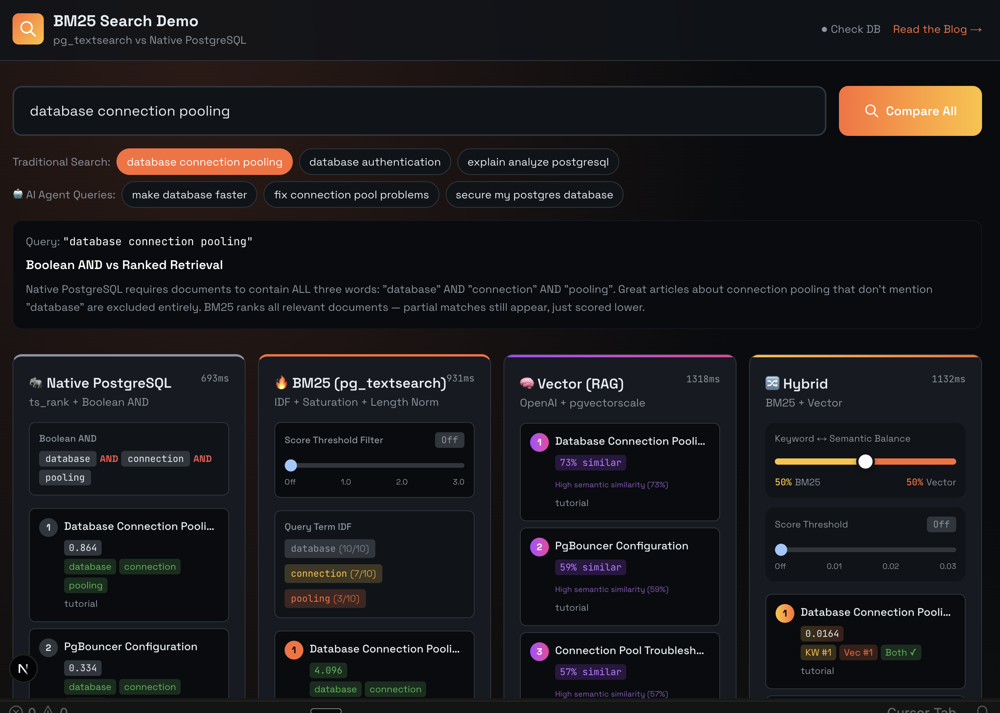

# Stop Running Elasticsearch. Just Use Postgres.

You want good search. So you're evaluating Elasticsearch. Or Algolia. Or Typesense. You're about to spin up another cluster, write data sync pipelines, and add one more thing to your on-call rotation.

**Stop.**

You already have Postgres. And now Postgres has BM25—the same ranking algorithm that powers Elasticsearch, Solr, and every serious search engine on the planet.

```sql
CREATE EXTENSION pg_textsearch;
CREATE INDEX ON articles USING bm25(content);

SELECT * FROM articles 
ORDER BY content <@> to_bm25query('database performance')
LIMIT 10;
```

That's it. Google-quality search ranking. In your existing database. No new infrastructure.

---

## "But Native Postgres Search Sucks"

You're right. It does. Let me show you why.

Say you have these 5 documents:

| Doc | Title | Content |
|-----|-------|---------|
| 1 | Connection Pooling Guide | "Database connection pooling improves performance..." |
| 2 | PostgreSQL Authentication | "Set up database authentication with SSL..." |
| 3 | SEO Spam | "Database database database. Database tips. Database database..." |
| 4 | Quick EXPLAIN Tip | "Use EXPLAIN ANALYZE to find slow queries." (15 words) |
| 5 | Complete Tuning Guide | "Comprehensive PostgreSQL guide... EXPLAIN... ANALYZE... performance..." (200 words) |

Now watch what happens with different searches:

### Problem 1: Keyword Stuffing Wins

**Search:** `database`

| Native Postgres | BM25 |
|-----------------|------|
| #1: SEO Spam (20 mentions!) | #1: Connection Pooling Guide |
| #2: Connection Pooling | #2: Authentication |
| #3: Authentication | #3: SEO Spam (pushed down) |

Native counts keywords. More = better. BM25 applies **term frequency saturation**—after a few mentions, additional repetitions barely help. Spam loses.

### Problem 2: Common Words Dominate

**Search:** `database authentication`

Native treats both words equally. But "database" appears in almost every doc—it tells you nothing. "Authentication" appears in only one doc—that's the signal.

BM25 uses **Inverse Document Frequency (IDF)**. Rare terms get higher weight. The authentication doc jumps to #1.

### Problem 3: Long Docs Always Win

**Search:** `EXPLAIN ANALYZE`

| Native Postgres | BM25 |
|-----------------|------|
| #1: Complete Tuning Guide (8 mentions) | #1: Quick EXPLAIN Tip |
| #2: Quick EXPLAIN Tip (2 mentions) | #2: Complete Tuning Guide |

The long guide has more keyword matches, so native ranks it higher. But the short tip is *entirely* about EXPLAIN ANALYZE—it's a better result. BM25 uses **length normalization** to fix this.

### Problem 4: All-or-Nothing Matching

**Search:** `database connection pooling`

Native Postgres uses Boolean AND by default. If a doc has "connection pooling" but not "database"? No match. Zero results.

BM25 does **partial matching**. Docs matching 2 of 3 terms still rank—just lower than docs matching all 3. You actually get results.

---

## What About Semantic Search?

BM25 handles keywords. For meaning, you need vectors.

Good news: Postgres does that too. With [pgvector](https://github.com/pgvector/pgvector) and [pgvectorscale](https://github.com/timescale/pgvectorscale), you can run hybrid search—BM25 + vectors—in one query:

```sql
-- Combine keyword + semantic search with Reciprocal Rank Fusion
WITH bm25 AS (
  SELECT id, ROW_NUMBER() OVER (ORDER BY content <@> to_bm25query($1)) as rank
  FROM docs LIMIT 20
),
vector AS (
  SELECT id, ROW_NUMBER() OVER (ORDER BY embedding <=> $2) as rank  
  FROM docs LIMIT 20
)
SELECT id, 1.0/(60+bm25.rank) + 1.0/(60+vector.rank) as score
FROM bm25 FULL JOIN vector USING (id)
ORDER BY score DESC LIMIT 10;
```

This is how RAG systems work. Both signals. One database.

---

## See It For Yourself

We built a demo that runs all four search methods side-by-side: Native Postgres, BM25, Vector, and Hybrid. Same query, same documents, different results. You'll see exactly why BM25 wins.



Type a query. Watch Native Postgres fail on partial matches while BM25 finds what you need. See how Vector search understands meaning. Watch Hybrid combine both for the best results. No hand-waving—just run queries and compare.

**Clone it:**
```bash
git clone https://github.com/rajaraodv/pg_textsearch_demo.git
cd pg_textsearch_demo
npm install
# Add DATABASE_URL and OPENAI_API_KEY to .env.local
npm run setup && npm run dev
```

**Or just use pg_textsearch directly:**
```sql
CREATE EXTENSION pg_textsearch;
CREATE INDEX docs_idx ON documents USING bm25(content) WITH (text_config='english');

SELECT title, content <@> to_bm25query('your search') as score
FROM documents
ORDER BY score
LIMIT 10;
```

---

## The Point

You don't need Elasticsearch. You don't need Algolia. You don't need another service to sync, monitor, and pay for.

You need [pg_textsearch](https://github.com/timescale/pg_textsearch).

It's fully open source under the [PostgreSQL license](https://opensource.org/licenses/PostgreSQL)—the same highly permissive license as Postgres itself. Use it anywhere, for anything, no strings attached.

Already available on [Tiger Data](https://console.cloud.timescale.com).

**Just use Postgres.**
