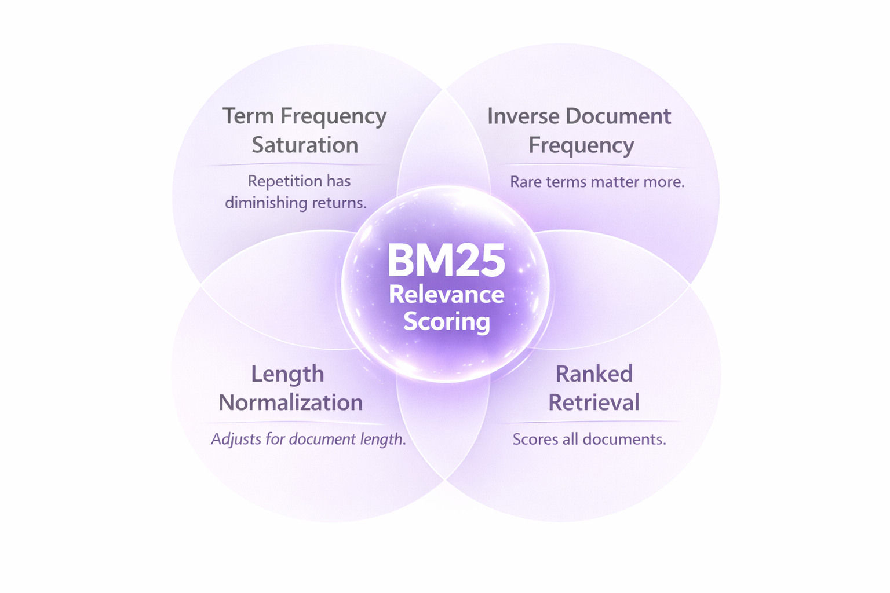

# Before You Add Elasticsearch, Try This

Postgres is everywhere. Millions of developers use it and love it. It's the database behind Stripe, Instagram, Spotify, and countless startups.

Search is everywhere too. Every app needs it. Product catalogs. Documentation. User content. Support tickets. And now: AI agents and RAG pipelines that need to find the right documents before generating answers.

So naturally, people try to use Postgres for search. And quickly hit its limits.

The usual next step? Add Elasticsearch. Or Algolia. Or Typesense. 

Suddenly you're:
- Spinning up another cluster (and keeping it running 24/7)
- Building data sync pipelines between Postgres and your search system
- Debugging why search results are stale or missing
- Adding another system to your on-call rotation
- Paying $1000s/month for a managed service, or hiring someone who knows how to run it

What if Postgres search was just... better?

It can be now. But first, let's look at what's actually wrong with native Postgres search.

---

## The Problem

Native Postgres full-text search treats relevance as a binary question: does this document match, yes or no?

That's not how search should work.

Let me show you. Say you have these documents:

```
📄 Database Connection Pooling Guide
   "Database connection pooling improves application performance. A pool 
   maintains reusable connections. Configure pool size based on workload."

📄 PostgreSQL Authentication Setup  
   "Set up PostgreSQL database authentication methods. Configure pg_hba.conf 
   for password, certificate, and LDAP authentication."

📄 Generic Blog Post
   "Database database database. Learn about database. Database is important. 
   Database database database. More database info."

📄 EXPLAIN ANALYZE Quick Tip (15 words)
   "Use EXPLAIN ANALYZE to find slow PostgreSQL queries. Shows execution 
   plan and actual timing."

📄 Complete PostgreSQL Query Tuning Guide (80 words)
   "This comprehensive PostgreSQL guide covers query tuning. PostgreSQL 
   query performance depends on proper use of EXPLAIN and EXPLAIN ANALYZE. 
   Run EXPLAIN ANALYZE on slow queries. The EXPLAIN output shows decisions..."
```

Now watch what happens:

### Search: `database`

| Native Postgres | What You'd Expect |
|-----------------|-------------------|
| #1: Generic Blog Post (12 mentions!) | #1: Connection Pooling Guide |
| #2: Connection Pooling Guide | #2: Something useful |
| #3: ... | #3: Not spam |

Native Postgres counts keywords. More mentions = higher rank. The spammy post wins.


### Search: `database authentication`

Native Postgres treats both words equally. But "database" appears in almost every doc. It's noise. "Authentication" appears in one doc. That's the signal.

Native doesn't know the difference.


### Search: `EXPLAIN ANALYZE`

| Native Postgres | What You'd Expect |
|-----------------|-------------------|
| #1: 80-word guide (8 mentions) | #1: Quick Tip (entirely about this) |
| #2: 15-word tip (2 mentions) | #2: Long guide (mentions it) |

Longer docs have more keyword matches, so they rank higher. But the short tip is *entirely* about EXPLAIN ANALYZE. It's the better result.


### Search: `database connection pooling`

Native uses Boolean AND by default. Only docs with ALL three terms match. You get 2 results out of 15.

Switch to OR? Now you get 13 results, but they all have the same score. No way to tell which is actually relevant.


---

## The Search Industry Solved This in the 90s

These aren't new problems. The search industry solved them decades ago with an algorithm called [BM25](https://en.wikipedia.org/wiki/Okapi_BM25).

BM25 (Best Matching 25) powers Elasticsearch, Solr, Lucene, and virtually every production search system. It fixes exactly the problems above:

**Term Frequency Saturation** - Mentioning a word 12 times doesn't make a doc 12× more relevant. After a few mentions, additional repetitions barely help. Spam loses.

**Inverse Document Frequency (IDF)** - Rare terms matter more. "Database" appears everywhere, so it's noise. "Authentication" appears once, so it's signal. BM25 weights accordingly.

**Length Normalization** - A focused 15-word tip about your query beats an 80-word doc that mentions it in passing. BM25 adjusts for document length.

**Ranked Retrieval** - Every doc gets a meaningful relevance score, not just "matches" or "doesn't match". Partial matches still appear, just ranked lower.



This is how Google worked from the beginning. It's table stakes for search.

---

## Now It's in Postgres

[pg_textsearch](https://github.com/timescale/pg_textsearch) brings BM25 to Postgres:

```sql
CREATE EXTENSION pg_textsearch;
CREATE INDEX ON articles USING bm25(content);

SELECT * FROM articles 
ORDER BY content <@> to_bm25query('database performance')
LIMIT 10;
```

Same documents. Same queries. Different results:

| Query | Native Postgres | With BM25 |
|-------|-----------------|-----------|
| `database` | Spam wins | Useful content wins |
| `database authentication` | Random order | Auth doc ranks #1 |
| `EXPLAIN ANALYZE` | Long doc wins | Focused tip wins |
| `database connection pooling` | 2 results (AND) or flat scores (OR) | Ranked results, partial matches included |

No new infrastructure. No data sync. Just better search.

---

## Hybrid Search (for AI)

BM25 handles keywords. For semantic understanding, you need vectors.

The best AI retrieval systems use both. This is why:
- [LangChain's EnsembleRetriever](https://python.langchain.com/docs/how_to/ensemble_retriever/) combines BM25 + vectors
- [Cohere recommends BM25](https://docs.cohere.com/docs/reranking-best-practices) as first-stage retrieval before reranking
- [Pinecone added hybrid search](https://docs.pinecone.io/guides/data/understanding-hybrid-search) combining sparse (BM25-style) and dense vectors

Postgres can do this too. With [pgvector](https://github.com/pgvector/pgvector), you run BM25 + vectors in one query:

```sql
-- Hybrid search with Reciprocal Rank Fusion
WITH bm25 AS (
  SELECT id, ROW_NUMBER() OVER (ORDER BY content <@> to_bm25query($1)) as rank
  FROM docs LIMIT 20
),
vector AS (
  SELECT id, ROW_NUMBER() OVER (ORDER BY embedding <=> $2) as rank  
  FROM docs LIMIT 20
)
SELECT id, 1.0/(60+bm25.rank) + 1.0/(60+vector.rank) as score
FROM bm25 FULL JOIN vector USING (id)
ORDER BY score DESC LIMIT 10;
```

Keywords + meaning. One database.


---

## Try It

We built a demo that runs Native Postgres, BM25, Vector, and Hybrid search side-by-side. Same query, same documents, different results.


```bash
git clone https://github.com/rajaraodv/pg_textsearch_demo.git
cd pg_textsearch_demo
npm install
# Add DATABASE_URL and OPENAI_API_KEY to .env.local
npm run setup && npm run dev
```

Or add to your existing Postgres:

```sql
CREATE EXTENSION pg_textsearch;
CREATE INDEX ON your_table USING bm25(content);

SELECT * FROM your_table 
ORDER BY content <@> to_bm25query('your search')
LIMIT 10;
```

---

## The Point

Postgres is everywhere. Search is everywhere. Now good search is in Postgres.

[pg_textsearch](https://github.com/timescale/pg_textsearch) is fully open source under the [PostgreSQL license](https://opensource.org/licenses/PostgreSQL). Use it anywhere, for anything.

Available now on [Tiger Data](https://console.cloud.timescale.com).

---

## Learn More

- [pg_textsearch GitHub](https://github.com/timescale/pg_textsearch)
- [Documentation](https://docs.timescale.com/use-timescale/latest/extensions/pg-textsearch/)
- [BM25 Algorithm (Wikipedia)](https://en.wikipedia.org/wiki/Okapi_BM25)
